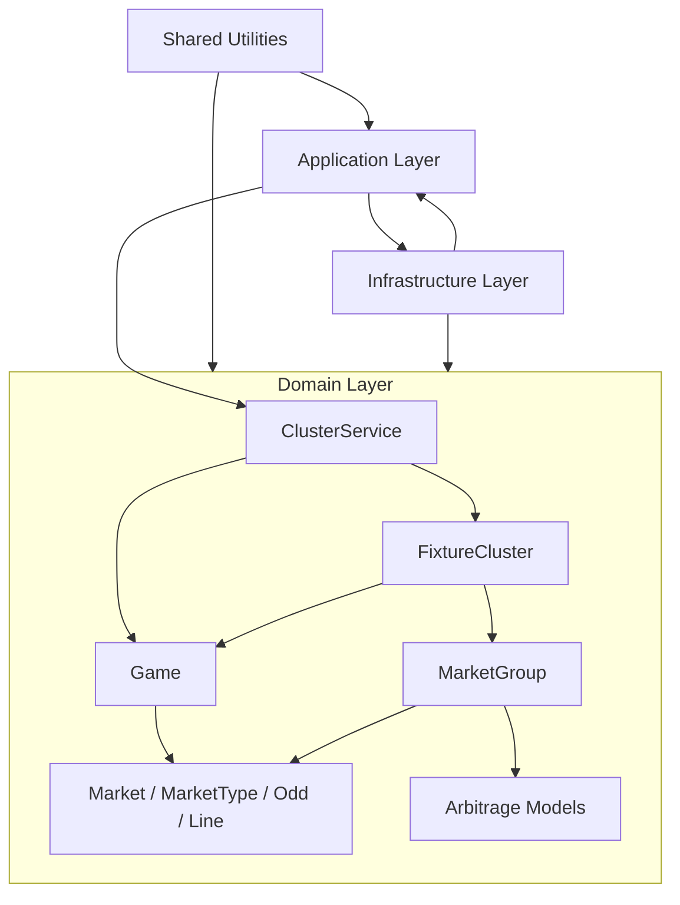

# rust-value-betting-engine

Rust engine for clustering equivalent fixtures across bookmakers, aggregating market data, and detecting arbitrage opportunities.

## Features

- Cross-bookmaker fixture clustering using normalized team, competition, country, and kickoff date data.
- Fuzzy fixture matching with `deunicode` and `strsim`-based similarity scoring.
- Domain models for `Game`, `FixtureCluster`, `Market`, `MarketType`, `Line`, and `Odd`.
- Support for match result, moneyline, total, handicap, and asian handicap market families.
- Incremental game market updates through `ClusterService::update_games` and `FixtureCluster::update_markets`.
- Arbitrage detection for two-way, three-way, and line-based markets.
- Stake distribution, guaranteed payout, guaranteed profit, and ROI calculations on arbitrage results.
- Unit coverage for fixture clustering, grouped market aggregation, market updates, and service-level update flows.

## Architecture

The project follows a layered, domain-first structure:



- `domain` contains the core betting model and rules. This is where fixture matching, grouped market aggregation, and arbitrage calculation live.
- `application` is the orchestration layer intended to coordinate use cases and workflows on top of the domain.
- `infrastructure` is reserved for adapters such as configuration, repositories, bookmaker feeds, persistence, or external APIs.
- `shared` contains technical cross-cutting helpers used across layers.

Inside the domain, the current design is centered around a few key concepts:

- `Game` owns normalized fixture metadata plus a market map keyed by `MarketType`.
- `FixtureCluster` groups equivalent games from different platforms and maintains a secondary index from `MarketType` to unique game IDs for grouped-market lookup.
- `ClusterService` builds and updates clusters incrementally while returning newly discovered arbitrage opportunities.
- `MarketGroup` and the arbitrage models encapsulate market-family-specific comparison and arbitrage logic.

## Layout

```text
├── Cargo.toml (project manifest: package metadata, dependencies, features, and cargo settings)
├── src (all application source code)
│   ├── lib.rs (library entry point: expose modules and public API)
│   ├── main.rs (binary entry point: keep startup thin and call into lib.rs)
│   ├── application (application layer: orchestration of business flows)
│   │   ├── mod.rs (register application submodules)
│   │   └── services (application services: coordinate workflows and integrations)
│   │      └── mod.rs (register application service modules)
│   ├── domain (core business logic and rules)
│   │   ├── mod.rs (register domain submodules)
│   │   ├── entities (stateful business objects like fixtures, markets, selections)
│   │   │   └── mod.rs (register entity modules)
│   │   ├── services (pure domain rules that do not belong to one entity)
│   │   │   └── mod.rs (register domain service modules)
│   │   └── value_objects (small immutable business types like odds or probabilities)
│   │       └── mod.rs (register value object modules)
│   ├── infrastructure (adapters for config, storage, HTTP, feeds, and other externals)
│   │   ├── mod.rs (register infrastructure submodules)
│   │   ├── config (configuration loading and startup settings)
│   │   │   └── mod.rs (register config modules)
│   │   └── repositories (database, file, API, or bookmaker adapter implementations)
│   │       └── mod.rs (register repository modules)
│   └── shared (cross-cutting technical utilities shared across layers)
│       ├── error.rs (shared error and result types)
│       └── mod.rs (register shared modules)
└── tests (integration and behavior-level tests)
    └── smoke_test.rs (example integration test against the public API)
```

## Adding Code

When you add a new folder under an existing module, create a `mod.rs` file inside that folder and register it in the parent module.

Example:

```rust
// src/domain/mod.rs
pub mod entities;
pub mod services;
pub mod value_objects;
```

If you add `src/domain/markets/mod.rs`, update `src/domain/mod.rs` with `pub mod markets;`.

## Commands

```sh
cargo run
cargo test
cargo test fixture_cluster
cargo test cluster_service
cargo fmt
cargo clippy --all-targets --all-features -- -D warnings
```