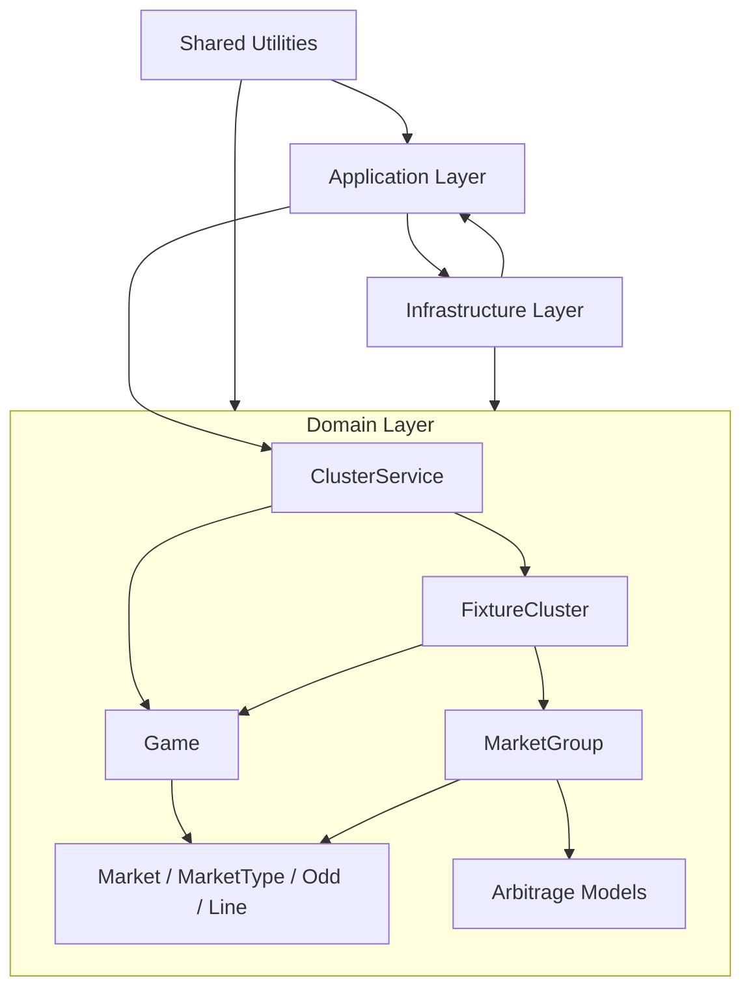

# rust-value-betting-engine

Rust engine for clustering equivalent fixtures across bookmakers, aggregating market data, detecting arbitrage opportunities, ingesting live odds via Chrome extension, comparing Polymarket prediction-market prices against bookmaker consensus, and executing automated trading strategies (paper or live).

## Features

- Cross-bookmaker fixture clustering using normalized team, competition, country, and kickoff date data.
- Fuzzy fixture matching with `deunicode` and `strsim`-based similarity scoring.
- Domain models for `Game`, `FixtureCluster`, `Market`, `MarketType`, `Line`, and `Odd`.
- Support for match result, moneyline, total, handicap, and asian handicap market families.
- Incremental game market updates through `ClusterService::update_markets` and `FixtureCluster::update_markets`.
- Arbitrage detection for two-way, three-way, and line-based markets.
- Stake distribution, guaranteed payout, guaranteed profit, and ROI calculations on arbitrage results.
- Unit coverage for fixture clustering, grouped market aggregation, market updates, and service-level update flows.
- **Benchmark suite** (AI-generated, see note below) measuring throughput, latency, CPU, and response time across various load profiles.
- **Chrome extension** with background service worker polling bookmaker APIs and forwarding data via native messaging.
- **Unix socket bridge** (`bridge` binary) for extension-to-engine communication with length-prefixed message framing.
- **Platform parser** system for converting raw API JSON into domain `Game` objects.
- **Polymarket live connector** for soccer: fetches upcoming events from the Gamma REST API (48h window), maps events/markets into domain `Game`s, streams live prices over the market WebSocket (raw channel with `custom_feature_enabled`), discovers newly listed markets via `new_market` events and subscribes to them incrementally.
- **Outcome diff statistics / percentiles**: per `(MarketType, Outcome)`, computes `diff = Polymarket implied probability − median bookmaker implied probability` across all fixture clusters and aggregates mean, median, and p05/p25/p75/p95 quantiles (order-statistics `QuantileMultiset`), streamed over `/statistics` SSE.
- **Trade domain & SQLite persistence**: `Trade` entity with open/close lifecycle, PnL, paper vs live flag, and a `TradeRepository` storing trades in SQLite.
- **Polymarket execution provider**: authenticated CLOB client (local signer) for posting signed limit orders (post-only), querying prices, waiting for order fills, and cancelling open orders.
- **DrawTimeDecay trading bot**: schedules a buy ~10 min before kickoff on low-priced soccer `draw` markets (price decay strategy), auto-sells after the market moves, resumes open trades on restart, and supports paper mode.
- **Backtesting framework**: pluggable `Strategy` trait, `TradeSimulator` (win rate, total/avg PnL, max drawdown, Sharpe ratio), and a `DrawValueStrategy` evaluated against stored Polymarket OHLCV candles.
- **`polymarket-cli` utility binary**: fetch historical soccer events from Gamma, backfill OHLCV candles from the pmxt.dev API, list/inspect/backup the DB, run the draw-value backtest, and execute the draw trading strategy.

## Architecture

The project follows a layered, domain-first structure:


```mermaid
flowchart TB
    A[Application Layer] --> DS[Domain Services]
    A --> I[Infrastructure Layer]

    subgraph D[Domain Layer]
        DS[ClusterService]
        G[Game]
        FC[FixtureCluster]
        MG[MarketGroup]
        M[Market / MarketType / Odd / Line]
        ARB[Arbitrage Models]

        DS --> FC
        DS --> G
        FC --> G
        FC --> MG
        G --> M
        MG --> M
        MG --> ARB
    end

    I --> A
    SH[Shared Utilities] --> A
    SH --> D
    I --> D
```

- `domain` contains the core betting model and rules. This is where fixture matching, grouped market aggregation, and arbitrage calculation live.
- `application` is the orchestration layer intended to coordinate use cases and workflows on top of the domain.
- `infrastructure` is reserved for adapters such as configuration, repositories, bookmaker feeds, persistence, or external APIs.
- `shared` contains technical cross-cutting helpers used across layers.

Inside the domain, the current design is centered around a few key concepts:

- `Game` owns normalized fixture metadata plus a market map keyed by `MarketType`.
- `FixtureCluster` groups equivalent games from different platforms and maintains a secondary index from `MarketType` to unique game IDs for grouped-market lookup.
- `ClusterService` builds and updates clusters incrementally while returning newly discovered arbitrage opportunities. Clusters are partitioned by **kickoff date** (`NaiveDateTime`) to narrow similarity search and avoid scanning irrelevant clusters.
- `MarketGroup` and the arbitrage models encapsulate market-family-specific comparison and arbitrage logic.

## Layout

```text
├── Cargo.toml (project manifest: package metadata, dependencies, features, and cargo settings)
├── benches (Criterion.rs benchmarks, AI-generated)
│   └── benchmarks.rs
├── chrome-extension (Chrome extension for bookmaker API polling)
│   ├── background.js (service worker: fetch APIs, send to native host)
│   ├── manifest.json
│   ├── platforms/
│   ├── popup/
│   └── native-host/
├── src (all application source code)
│   ├── lib.rs (library entry point: expose modules and public API)
│   ├── main.rs (binary entry point: keep startup thin and call into lib.rs)
│   ├── bin (additional binaries)
│   │   ├── bridge.rs (Unix socket bridge between extension and engine)
│   │   └── polymarket_cli.rs (fetch/store Polymarket data, backtest, run trade bot)
│   ├── application (application layer: orchestration of business flows)
│   │   ├── mod.rs (register application submodules)
│   │   ├── backtesting (backtest execution on stored Polymarket history)
│   │   └── services (application services: coordinate workflows and integrations)
│   │      ├── mod.rs (register application service modules)
│   │      └── trading (automated trading strategies)
│   │         ├── mod.rs
│   │         └── draw_trade_bot.rs (DrawTimeDecay bot: scheduled buy/sell on Polymarket)
│   ├── benchmark (benchmark data generators, AI-generated)
│   │   ├── mod.rs
│   │   └── data.rs
│   ├── domain (core business logic and rules)
│   │   ├── mod.rs (register domain submodules)
│   │   ├── entities (stateful business objects like fixtures, markets, selections)
│   │   │   ├── mod.rs (register entity modules)
│   │   │   ├── game.rs
│   │   │   ├── market.rs
│   │   │   ├── fixture_cluster.rs
│   │   │   ├── arbitrage.rs
│   │   │   ├── trade.rs (trade lifecycle: open/close, PnL, paper/live)
│   │   │   └── platform.rs
│   │   ├── services (pure domain rules that do not belong to one entity)
│   │   │   ├── mod.rs (register domain service modules)
│   │   │   ├── quantile_multiset.rs (order-statistics percentile multiset)
│   │   │   ├── cluster_statistics.rs (diff percentiles per market/outcome)
│   │   │   └── backtesting (strategy trait, simulator, metrics)
│   │   └── value_objects (small immutable business types like odds or probabilities)
│   │       └── mod.rs (register value object modules)
│   ├── infrastructure (adapters for config, storage, HTTP, feeds, and other externals)
│   │   ├── mod.rs (register infrastructure submodules)
│   │   ├── config (configuration loading and startup settings)
│   │   │   └── mod.rs (register config modules)
│   │   ├── bridge (BridgeMessage types and serialization)
│   │   │   ├── mod.rs
│   │   │   └── types.rs
│   │   ├── connectors (bookmaker data parsers and bridge connector)
│   │   │   ├── mod.rs
│   │   │   ├── bridge_connector.rs (Unix socket client, receives messages)
│   │   │   ├── betano_connector.rs (Betano API JSON → Vec<Game> parser)
│   │   │   ├── lebull_connector.rs (LeBull HTTP polling parser)
│   │   │   ├── bwin_connector.rs (Bwin API parser)
│   │   │   └── polymarket_connector.rs (Gamma events + market WebSocket stream)
│   │   ├── polymarket_provider.rs (authenticated Polymarket CLOB execution client)
│   │   ├── config (configuration loading and startup settings)
│   │   │   ├── mod.rs (register config modules)
│   │   │   └── trade_config.rs (bankroll, price bands, buy/sell offsets)
│   │   ├── repositories
│   │   │   ├── mod.rs (register repository modules)
│   │   │   ├── trade_repository.rs (SQLite trades persistence)
│   │   │   └── polymarket_repository.rs (events, markets, OHLCV price history)
│   │   └── shared (cross-cutting technical utilities shared across layers)
│   │       ├── error.rs (shared error and result types)
│   │       └── mod.rs (register shared modules)
└── tests (integration and behavior-level tests)
    └── smoke_test.rs (example integration test against the public API)
```

## Data ingestion flow

```
Chrome extension background.js
  │  setInterval → fetch Betano API → parse → sendToNative
  ▼
Native messaging host (stdin/stdout)
  │  length-prefixed JSON frames
  ▼
bridge binary (src/bin/bridge.rs)
  │  UnixListener → accept → forward messages
  ▼
BridgeConnector (src/infrastructure/connectors/)
  │  reads from Unix socket → deserializes BridgeMessage
  ▼
BetanoParser → Vec<Game>
  ▼
ClusterService → arbitrage detection
```

## Benchmarks

The benchmark suite in `benches/benchmarks.rs` and the data generators in `src/benchmark/data.rs` are **AI-generated**. They were produced by an LLM based on the project's architecture and are provided as a starting point for performance measurement.

The suite uses [Criterion.rs](https://github.com/bheisler/criterion.rs) and covers:

| Group | What it measures |
|-------|-----------------|
| `throughput` | Games inserted per second (new clusters, existing clusters, insert+update) |
| `latency` | Arbitrage detection latency under no load, steady load, bursts, stale updates, and capacity curves |
| `cpu_mem` | Per-game insert cost into growing clusters, and ClusterService initialization throughput |
| `response` | Raw operation times for similarity scoring, cluster arbitrage scans, market group arbitration, and fixture matching |

Run with:

```sh
cargo bench --bench benchmarks
```

Results are written to `target/criterion/` and include Criterion HTML reports and a structured analysis.

> **Note:** These benchmarks were reviewed and adjusted for correctness but should be validated against real workload patterns before making performance-critical decisions.

## Adding Code

When you add a new folder under an existing module, create a `mod.rs` file inside that folder and register it in the parent module.

Example:

```rust
// src/domain/mod.rs
pub mod entities;
pub mod services;
pub mod value_objects;
```

If you add `src/domain/markets/mod.rs`, update `src/domain/mod.rs` with `pub mod markets;`.

## Commands

```sh
cargo run            # run the engine
cargo test
cargo test fixture_cluster
cargo test cluster_service
cargo bench --bench benchmarks
cargo fmt
cargo clippy --all-targets --all-features -- -D warnings
```

Polymarket CLI (requires `PMXT_API_KEY` for `fetch-prices` and `POLYMARKET_PRIVATE_KEY` for live trading):

```sh
cargo run --bin polymarket-cli -- fetch-matches --maybe-start-date-min 2024-01-01
cargo run --bin polymarket-cli -- fetch-prices
cargo run --bin polymarket-cli -- list
cargo run --bin polymarket-cli -- info
cargo run --bin polymarket-cli -- backup
cargo run --bin polymarket-cli -- backtest
cargo run --bin polymarket-cli -- draw-trade --paper
```

Environment: `PMXT_API_KEY` (pmxt.dev API), `POLYMARKET_PRIVATE_KEY` (CLOB signer for live orders), and the CLI's `-d/--db-path` (default `polymarket_data.db`).